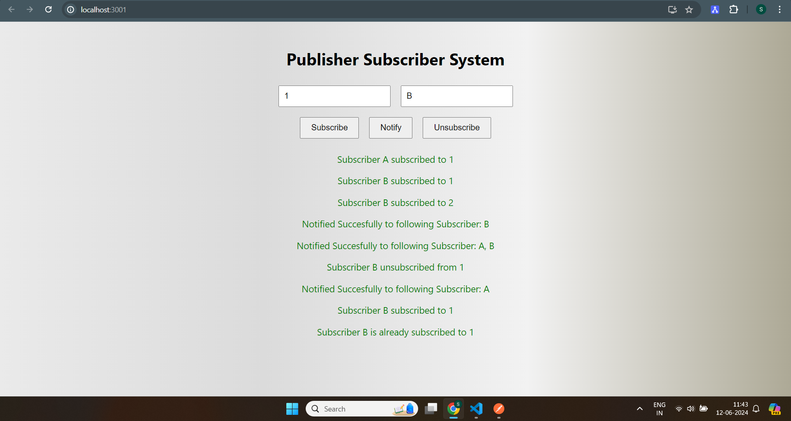
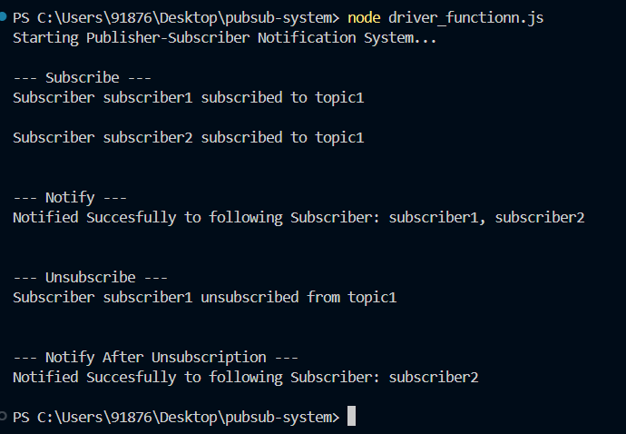

# Publisher Subscriber Notification System

This project implements a simple Publisher-Subscriber Notification System using Node.js for the backend and React.js for the frontend.

## Features

1. **Subscribe to a Topic**: Subscribers can subscribe to a topic.
2. **Notify Subscribers**: Send notifications to all subscribers of a topic.
3. **Unsubscribe from a Topic**: Subscribers can unsubscribe from a topic.

## Backend

The backend is implemented using Node.js and Express.

### APIs

1. **Subscribe**
   - **Endpoint**: `/subscribe`
   - **Method**: `POST`
   - **Body**: `{ "topicId": "string", "subscriberId": "string" }`
   - **Description**: Adds a subscriber to a topic.

2. **Notify**
   - **Endpoint**: `/notify`
   - **Method**: `POST`
   - **Body**: `{ "topicId": "string" }`
   - **Description**: Sends notifications to all subscribers of a topic.

3. **Unsubscribe**
   - **Endpoint**: `/unsubscribe`
   - **Method**: `POST`
   - **Body**: `{ "topicId": "string", "subscriberId": "string" }`
   - **Description**: Removes a subscriber from a topic.

### Internal Data Structures

- **JavaScript Object (`topics`)**: Stores topics and their corresponding subscribers.
  - Key: `topicId` (string)
  - Value: `Set` of `subscriberId`s (Set of strings)

- **Set**: Ensures unique subscribers for each topic.

### Edge Cases

1. **Non-existent Topic Notification**: Attempting to notify subscribers of a non-existent topic returns a 404 error.
2. **Duplicate Subscription**: Subscribing a subscriber to a topic they are already subscribed to does not create duplicate entries due to the use of a `Set`.
3. **Unsubscribe Non-existent Subscriber**: Attempting to unsubscribe a subscriber who is not subscribed to the topic returns a 404 error.

## Frontend

The frontend is implemented using React.js.

### Features

- **Subscribe**: Enter a topic ID and subscriber ID to subscribe to a topic.
- **Notify**: Enter a topic ID to notify all subscribers.
- **Unsubscribe**: Enter a topic ID and subscriber ID to unsubscribe from a topic.

## Running the Project

### Backend

1. Navigate to the `pubsub-system` directory.
2. Install the required packages:
    ```bash
    npm install express body-parser cors axios
    ```
3. Start the backend server:
    ```bash
    node index.js
    ```

### Frontend

1. Navigate to the `pubsub-client` directory.
2. Install the required packages:
    ```bash
    npm install
    ```
3. Start the React development server:
    ```bash
    npm start
    ```

### Driver Script

1. Ensure the backend server is running.
2. Run the driver script to demonstrate the flow of the application:
    ```bash
    node driver_functionn.js
    ```

## Example Flow

1. Subscribe `subscriber1` and `subscriber2` to `topic1`.
2. Notify subscribers of `topic1`.
3. Unsubscribe `subscriber1` from `topic1`.
4. Notify subscribers of `topic1` after unsubscription.

The driver script will output the results of each operation.

<hr>
## Postman Documentation

The API endpoints for the Publisher-Subscriber Notification System are documented in Postman. You can import the collection to view and test the endpoints.

### Shareable Link
### Importing the JSON Collection

If the shareable link is not available, you can import the Postman collection using the JSON file included in the repository.

1. Download the `PubSubSystem.postman_collection.json` file from the repository.
2. Open Postman and click on `Import` in the top left.
3. Select the `Upload Files` tab.
4. Choose the downloaded JSON file and click `Import`.

This will import all the API endpoints into your Postman workspace.

You Can also find shared valid json config for postman collection which is uploaded on repo along with code

<hr>
### Screenshots

<p align="center">
  
</p>

<p align="center">
  
</p>
<hr>

## Conclusion

This project demonstrates a simple implementation of a Publisher-Subscriber Notification System using Node.js and React.js. The internal data structures ensure efficient and correct handling of subscriptions, notifications, and unsubscriptions.
